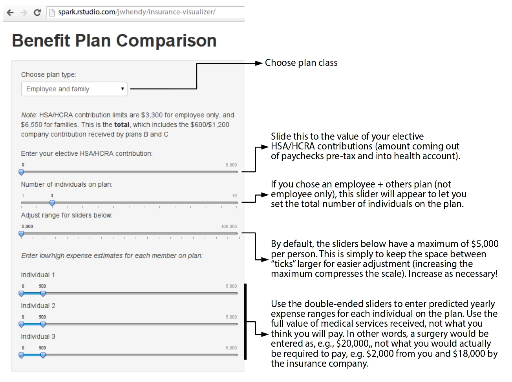
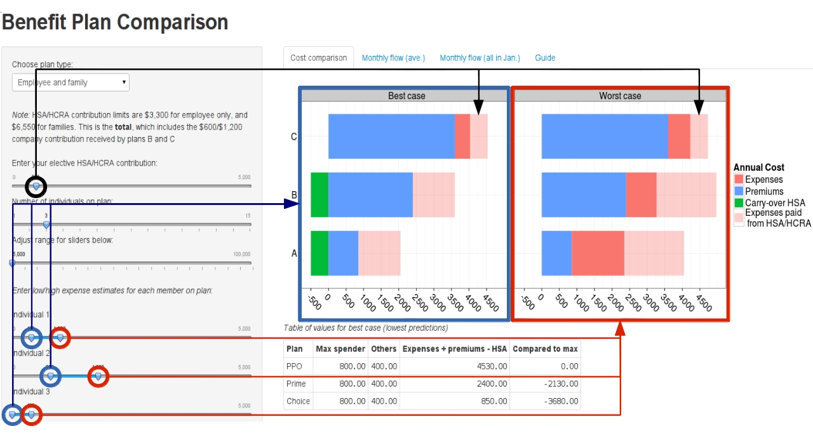
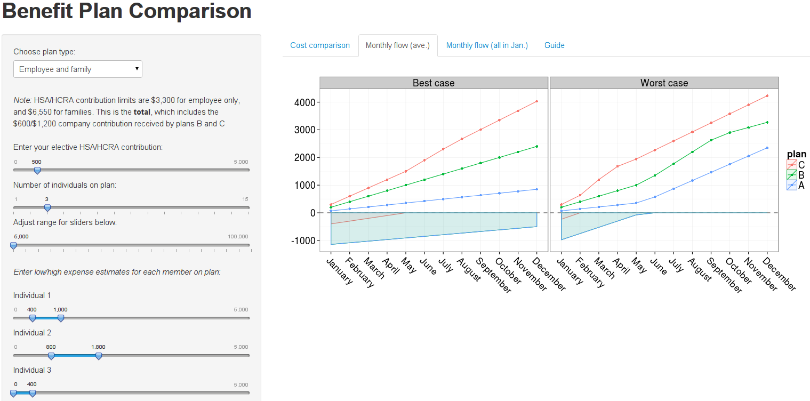
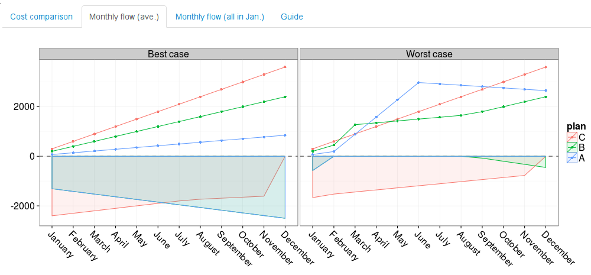
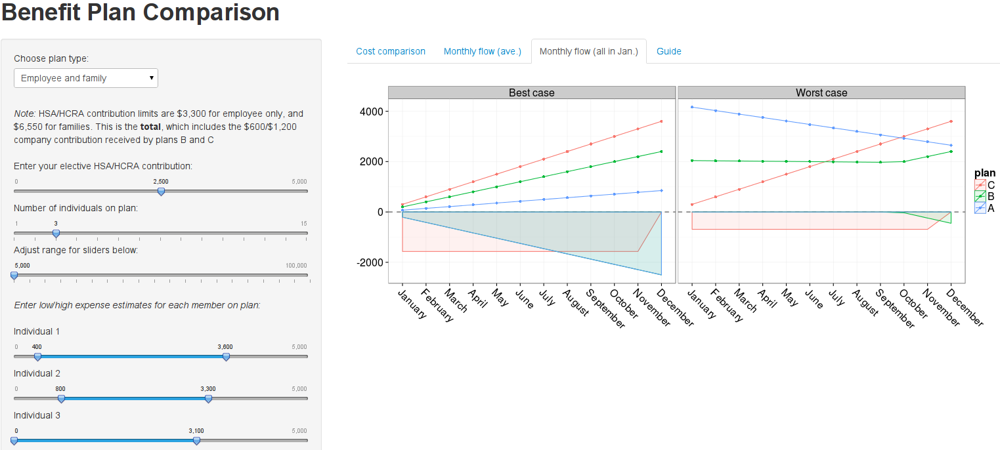

Introduction
-----

For the past three years, I've been conducting insurance plan analyses as a hobby project at my place of work. Initially, plans were relatively simple. All you need to know is a plan's deductible, out of pocket maximum, cost of premiums, and the value of company-contributed HSA funds (if applicable), and you can compare plans.

For 2011 and 2012, I created a deck of slides and an accompanying screencast, which I made available on internal company blogs. In 2012, I was already thinking interactive visualization and made an attempt using the [`playwith` package](http://cran.r-project.org/web/packages/playwith/index.html). Unfortunately, `playwith` plots are not available to others unless the run the actual R code. When I discovered `shiny` about a year ago, I knew this year's analysis would be an interactive one!

If you want to modify this to work with your insurance plans, or just take a look at the code and fiddle around, it's available on [github](https://github.com/jwhendy/insurance-visualizer).

Plan details and assumptions
-----

The plans considered here are assumed to follow the typical "phases" of medical bills incurred vs. what you actually pay:

$$
f(x) = \begin{cases}
Expenses & \text{if} \quad 0 < x < Ded \\
Ded + (0.10 \times (Expenses - Ded)) & \text{if} \quad Ded  \le x <  Expenses_{max} \\     
OOP_{max} & \text{if} \quad Expenses_{max} \le x < \infty
\end{cases}
$$

In other words, you puy in full up to the deductible, 10% from there to the out of pocket maximum, and then nothing additional once you reach that point. The 10% figure is based on my company's plans; yours may vary.

Be aware that there are slight differences between the plans used in this visualization as well:

```{r}
| Plan | Premium | Deductible | Type  | Family |
|------+---------+------------+-------+--------|
| A    | High    | Low        | Split | PPO    |
| B    | Medium  | Medium     | Total | HSA    |
| C    | Low     | High       | Split | HSA    |
+----------------------------------------------+  
```

Note the difference in type. Plans A and C feature what is called a "split" deductible and out of pocket maximum: an individual value and a total value. In each case, the individual value is half of the total value. Let's say a plan has a $5,000 deductible. If a single individual reaches $2,500 in expenses on his/her own, they are covered (only paying 10% of additional expenses). Once the remaining plan members make up the remaining deductible ($2,500), they begin receiving coverage. The same applies for the out of pocket maximum. One individual *can not* achieve the total deductible/out of pocket maximum for the entire family.

The second major difference is in the plan family. A is a PPO plan, while B and C are HSA plans. The most direct outcome of this, at least at my company, is that plans B and C receive company HSA contributions (free money). A secondary impact of this has to do with how elective contributions are treated. Elective, pre-tax dollars coming out of your paycheck for plan A go into an HCRA, while B and C have (obviously) an attached HSA.

- *HCRA:* Contribution amount is not adjustable once enrolled, yearly contribution amount is available at the beginning of the plan year, and funds cannot be rolled over into future years.

- *HSA:* Contribution amount can be adjusted at any time, funds become available as they are deducted from each pay periods paycheck, and the account is always yours, even if you leave the company.

So, if you elected to have $100/month directed into your health care amount, plan A would make all $1,200 available to you as soon as your coverage under that plan begins. In essence, the company is "fronting" you the money and paying themselves back in $100 increments from your monthly paychecks. For plans B and C, you would start your coverage with the company-provided HSA fund in your account, and an additional $100/month would funnel in with each paycheck.

There are often different coverage options for plans, as well. In my case, we are offered four flavors of coverage: employee only, employee + spouse, employee + children, and employee + family. The deductibles and out of pocket maximums have only two levels: employee only or employee + others. The premiums vary for each group, however. Here is the full list of plan values used here (anonymized from my company's actual values):

```{r}
| plan | class      | ded_ind | ded_tot | oop_ind | oop_tot | prem |  hsa | exp_max_ind | exp_max_tot |
|------+------------+---------+---------+---------+---------+------+------+-------------+-------------|
| A    | emp        |         |     500 |         |    5000 | 1100 |    0 |             |       45500 |
| A    | emp_spouse |     500 |     900 |    5000 |   10000 | 2600 |    0 |       45500 |       91900 |
| A    | emp_child  |     500 |     900 |    5000 |   10000 | 2200 |    0 |       45500 |       91900 |
| A    | emp_fam    |     500 |     900 |    5000 |   10000 | 3600 |    0 |       45500 |       91900 |
|------+------------+---------+---------+---------+---------+------+------+-------------+-------------|
| B    | emp        |         |    1250 |         |    3000 |  900 |  600 |             |       18750 |
| B    | emp_spouse |         |    2500 |         |    6000 | 1700 | 1200 |             |       37500 |
| B    | emp_child  |         |    2500 |         |    6000 | 1600 | 1200 |             |       37500 |
| B    | emp_fam    |         |    2500 |         |    6000 | 2400 | 1200 |             |       37500 |
|------+------------+---------+---------+---------+---------+------+------+-------------+-------------|
| C    | emp        |         |    2500 |         |    5000 |  325 |  600 |             |       27500 |
| C    | emp_spouse |    2500 |    5000 |    5000 |   10000 |  625 | 1200 |       27500 |       55000 |
| C    | emp_child  |    2500 |    5000 |    5000 |   10000 |  550 | 1200 |       27500 |       55000 |
| C    | emp_fam    |    2500 |    5000 |    5000 |   10000 |  850 | 1200 |       27500 |       55000 |
+------+------------+---------+---------+---------+---------+------+------+-------------+-------------+
```

Confused yet? The "codey" names at the top are simplifications of the values we've discussed above.

- `ded_ind`, `ded_tot`, `oop_ind` and `oop_tot`: the individual (if applicable) and total deductibles and out of pocket maximums for each plan.
- `prem`: the annual premium paid for each plan.
- `hsa`: the company HSA contribution for plans B and C.
- `exp_max_ind` and `exp_max_tot`: while `oop_ind` and `oop_tot` is the maximum amount that *you* will ever pay, we need to calculate the amount of medical bills one would need to accrue in order to actually hit that value, which follows the formula: $10(oop - ded) + ded$


So, what am I looking at?
-----

As you might see from the above, things get complicated quickly. Well, honestly, they're not *that* complicated, but my motivation for a visualization in general is that the human mind can't look at a table and calculate project costs for each of the plans. The split deductible feature *really* hammers that home since you need to know how much your highest cost individual might spend, how much the rest of the plan members might spend, and then figure out if the individual/total decutible or out of pocket maximums have been reached. Based on *those* criteria, you can finally apply the appropriate formula based on which "phase" of expenses you're in.

The plots in this app are my current best shot at making the financial impact to you on each of the plans interpretable. Let's start with UI:



The first tab shows the overall cost of each plan based on the predicted expenses input using the double sliders.



This is a little busy, but here's what's going on: the left and right slider values (low and high estimates, respectively) for each individual feed into an algorithm to determine if the deductible/out of pocket max (including split values!) are met based on each plan's cutoffs. The resultant amount you would pay on each plan is plotted as a stacked [horizontal] bar chart.

Blue shows the premium cost for each plan, and red shows the amount you pay for medical expenses received. If a plot features green, HSA funds were greater than the expenses paid, and money is carried over in the account for future medical expenses. Plan C (which uses an HCRA) will never features a green portion since funds cannot be carried over from year to year. Thus, if you overestimate your payroll contribution into an HCRA, you will lose that money.

The translucent red portion (looks pink) shows the amount of medical expenses that were paid with HSA/HCRA funds (adding the HSA/HCRA slider value to any applicable company-provided funds). Note that for many scenarios, the full length of plans A and B is greater than plan C, yet when only comparing the solid portion of the bar (exclude the pink), plans A and B are typically lower than plan C. This is crucial, as it shows that a low deductible plan may *not* have the lowest financial impact when all aspects are considered.

The second tab provides a way to view expenses throughout the year.



This tab takes the estimates for each individual and assumes that expenses will be evenly distributed throughout the year (monthly cost = slider value/12). Lines display cumulative cost (total spent to date), so the points for the month of December match the values shown by the bar charts in the previous tab. The shaded region below the x-axis shows the state of the HSA/HCRA funds throughout the year. In this case, one can see the funds used at a faster rate in the higher expense scenario. As with the bars, plan C with it's HCRA will never end the year with a region below the x-axis since funds cannot be carried over.

Interesting things can occur with high HSA contributions -- play around with high elective contributions and high expenses! Sometimes the plan expense lines cross... and then cross again:



Note the large starting value of the HCRA (red area under the x-axis); this is due to the fact that HCRA funds are made available immediately in January, whereas HSA elective contributions are only made available with each paycheck throughout the year. What's happening when lines cross is that the higher deductible nature of plans A and B drain the HSA account almost immediately, and the experienced cost continues to grow since the deductible is still not met. In June, we see a huge change in slope for plan A, illustrating that it's high deductible has now been met.

But given that this is shown *cumulative cost* (what one has paid to-date), how can costs *decrease*? Shouldn't cumulative cost always stay the same or increase? What's happening is that once the deductible has been met, the HSA payroll deductions are now greater than the monthly expenses, and the family is essentially reimbursing themselves from these funds for expenses earlier in the year. I found this quite interesting, and shows the necessity of data visualization -- I would never have predicted this happening without an interactive plot I could easily fiddle with.

The above observation made it apparent that one might pay *more* in earlier parts of the year than another plan, yet still play *less* by the end of the year due to the HSA funds trickling in. Since this requires plan members to "front" their expense costs in early months, I thought it would be helpful to look at the worst of all scenarios: all expenses occur in January. This allows us to see the most one might have to pay up front. Here's an example:



We see that plan B ends the year ~$1,000 less than plan C, however one would have to pay nearly $2,000 more up front in January with this scenario. While saving $1,000 overall still seems quite a bit more attractive than trying to save one's self from a $2,000 expense temporarily, this certainly *could* be a situation to consider of monthly cash flow is tight and an expense like that would severly impact one's life. One counter to this is that even if an expensive treatment was received in January, it will take some weeks (even a couple of months) for the claim to be processed, to receive a bill, and to come to a deadline on that bill. Let's say this puts us into March. By that time, the gap will have narrowed and the trade-off should be less advantageous.

At the very least, this plot can help prepare for potential occurrences like this, as well as to bring out concrete details if one is going to avoid a hit in January. My opinion is that to do this, one needs to plainly say: "I want to save $2,000 in January so that I can pay $1,000 more by the end of the year."